# VOID

***LLM chat interfaces are usually boring, so I made one that's cool.***

## Some of the states

| | | |
|---|---|---|
| 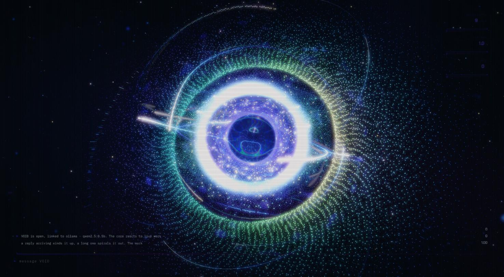 **standby** — nothing happening, the core drifts on its own ambient rhythm | 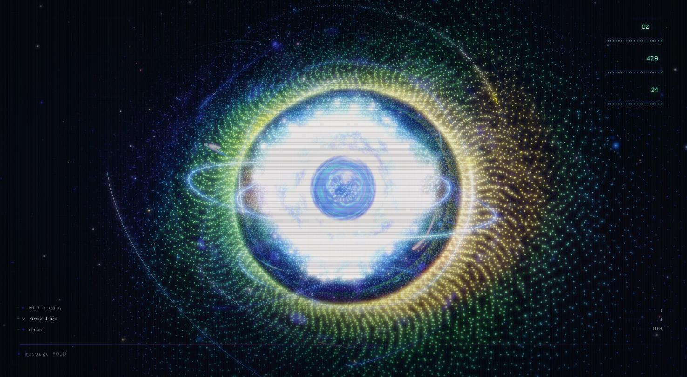 **dream** — deep idle, the sky comes all the way forward | 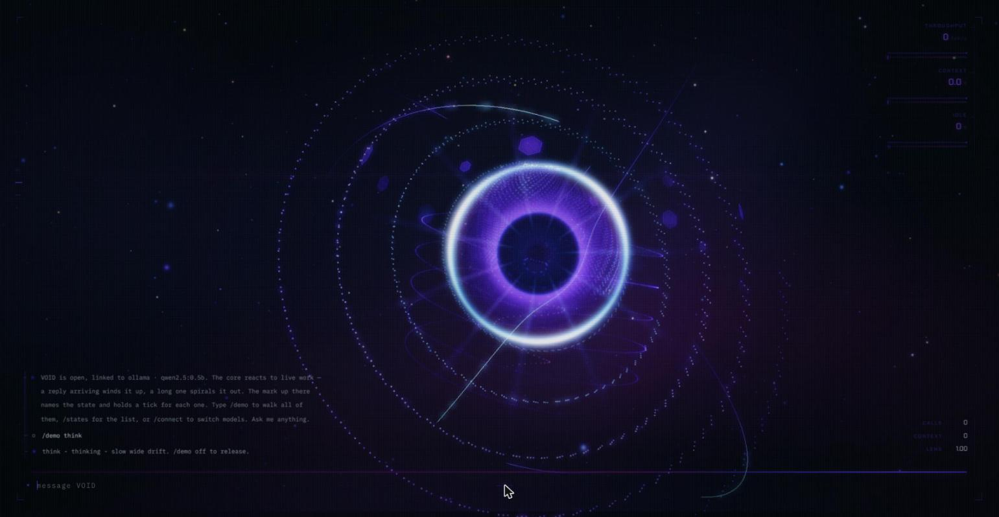 **think** — slow wide drift while the model reasons |
| 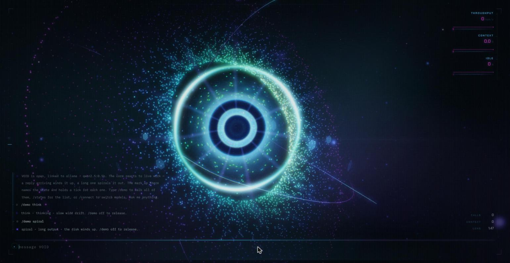 **spiral** — a long reply arriving; the disk winds up as it streams in | 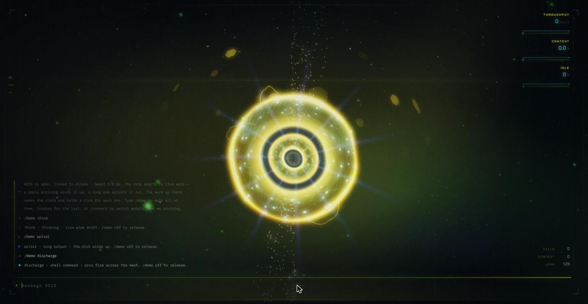 **discharge** — a shell/tool-style burst, arcs firing across the mesh | 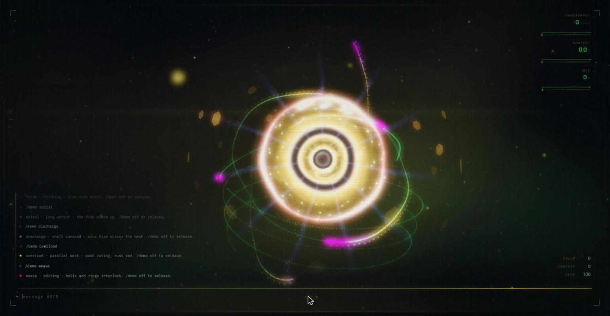 **weave** — an edit-shaped state, helix and rings interlocking |
| 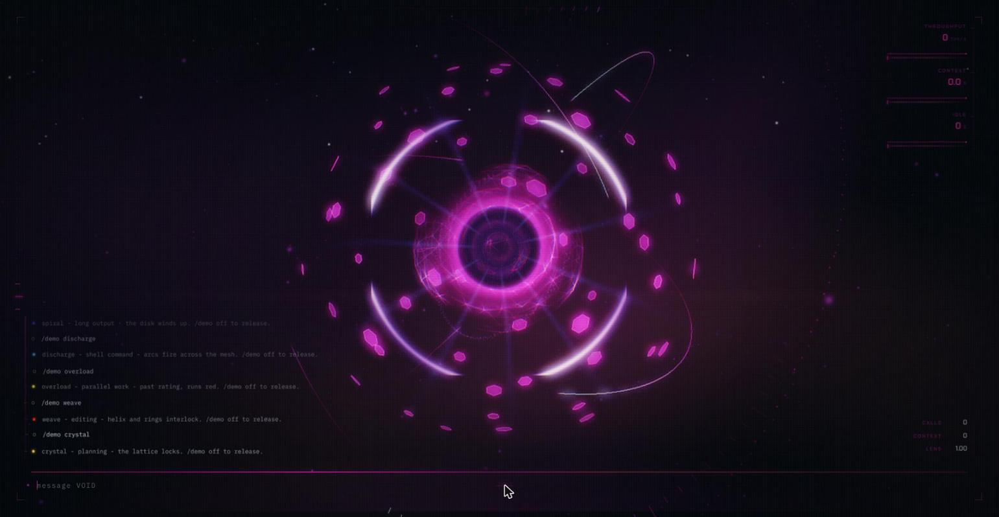 **crystal** — a planning state, the lattice locks into place | 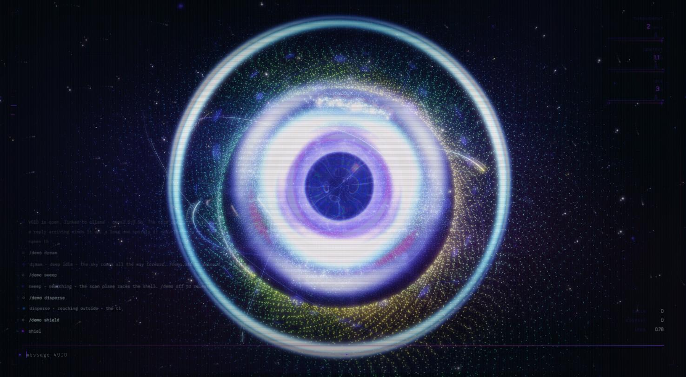 **shield** — waiting on you, shields lock until answered | 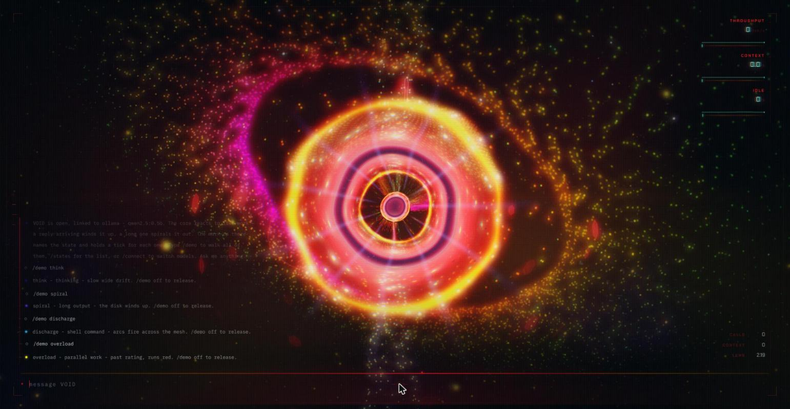 **overload** — heavy concurrent work, the core runs hot and red |
| 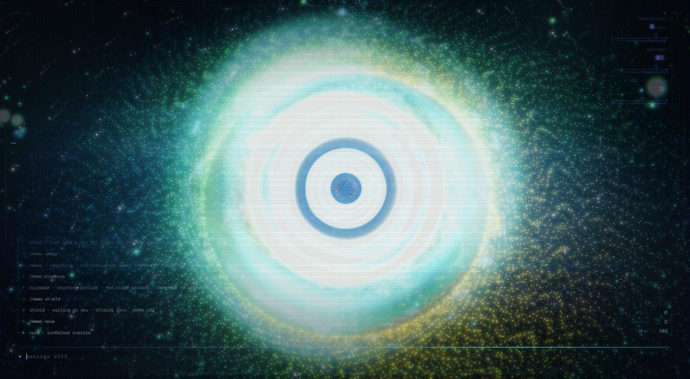 **nova** — sustained overload, the core blazes over | 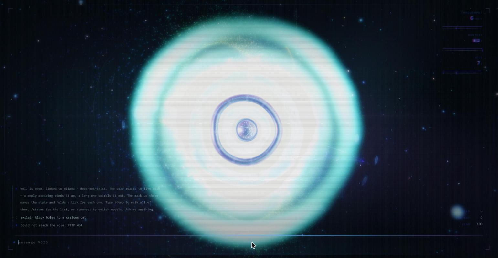 **flare** — a hard flash on error, decaying back | 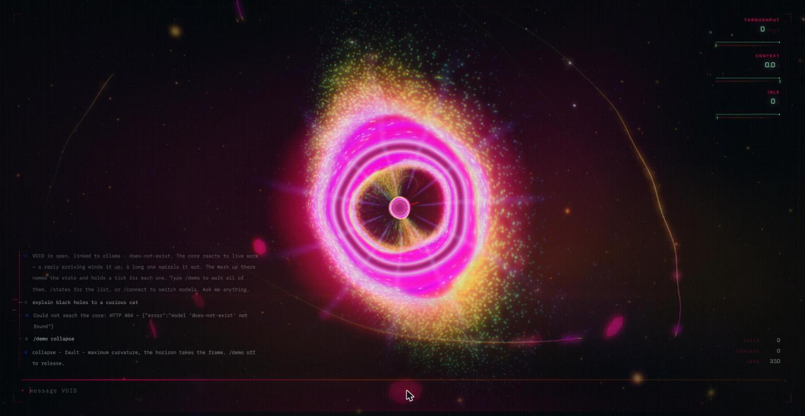 **collapse** — a fault, maximum curvature, the horizon takes the frame |

Type `/states` in the dock to see the full list of 27, or `/demo` to watch
VOID cycle through all of them, or `/demo <name>` to hold one and study it.

## The cosmic score

Type `/cosmos` for a slow tour of five mathematical scenes. Use `/cosmos off`
to return to live activity, or `/demo <name>` to hold a scene.

| Scene | Structure |
|---|---|
| `hopf` | 24 linked circles from phase orbits on the 3-sphere, stereographically projected into 3D |
| `attractor` | A Lorenz orbit integrated with fourth-order Runge–Kutta, with the initial transient discarded |
| `orrery` | Nine closed (2,3) torus knots, their planes distributed by the golden angle |
| `cathedral` | 13 paired logarithmic spiral ribbons, expanding by the golden ratio per revolution |
| `chrysalis` | 5,200 Fibonacci sphere samples carrying two interfering standing-wave modes |

These are mathematical visualizations composed as artwork, not physical
simulations of celestial objects. Each scene gives one structure the lead;
quieter accents also accompany thinking, streaming, editing, and planning.
Geometry is built once and animated on the GPU. The new sculptures freeze
under reduced motion and reduce detail with the existing quality watchdog.
No additional dependencies or API connection are required.

## Bring your own model

VOID doesn't ship a backend. It talks directly, from the browser, to
whatever API you point it at:

- **OpenAI** — and anything that speaks the same chat-completions dialect
  (Groq, OpenRouter, local llama.cpp servers, etc.)
- **Anthropic** (Claude)
- **Ollama** — fully local, no API key, `localhost:11434`

Open `void.html` (just double-click it, or serve it with anything static)
and link a model from the message dock:

```
/connect openai      sk-...              gpt-4o-mini
/connect anthropic   sk-ant-...          claude-sonnet-4-20250514
/connect ollama                          llama3.2
/connect groq         gsk_...            llama-3.3-70b-versatile
/connect openrouter   sk-or-...          openai/gpt-4o-mini
/connect custom       https://host/v1    sk-...     my-model
```

Arguments after the provider name are `[api-key] [model]` (for `ollama` and
`custom` it's `[base-url] [model]` / `<base-url> <api-key> [model]`). Once
connected the choice is remembered in `localStorage`, so reloading the page
picks the same model back up. `/connect` on its own shows the current
connection; `/model <name>` and `/key <key>` change one piece without
retyping the rest.

Because the browser talks to these APIs directly, no data passes through
any third-party server other than the one you connect to — your key never
leaves the page except in requests to that provider.

### A note on Anthropic and CORS

Anthropic's API supports direct browser calls when the request includes an
explicit opt-in header, which VOID sends automatically. No proxy needed.

## Commands

Everything happens in the one input field at the bottom:

| Command | What it does |
|---|---|
| `/connect [provider] [...]` | Link a model, or show the current connection |
| `/model <name>` | Switch models without touching the rest of the config |
| `/key <key>` | Update the API key in place |
| `/states` | List every visual state and what triggers it |
| `/cosmos` | Tour the five mathematical scenes at a slower pace |
| `/cosmos off` | Return to live activity |
| `/demo` | Tour all states automatically |
| `/demo <name>` | Hold one state so you can look at it |
| `/demo off` | Release the demo and return to live activity |
| `/stop` | Abort the current turn |

## Running it

There's genuinely nothing to install.

```bash
python3 -m http.server 5713
# open http://localhost:5713/void.html
```

or just open the file directly in a browser. If you're connecting to a
local Ollama instance, make sure it's running (`ollama serve`) — VOID talks
to it on `localhost:11434` by default.
